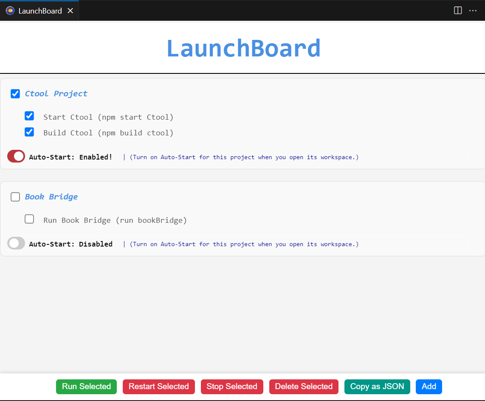

# LaunchBoard 🚀  

A **VS Code extension** to run project-specific commands fast with a clean UI.

## Features  
- ✅ **Run Commands** - Execute project commands without opening a terminal.  
- 🔄 **Auto-Start Projects** - Launch projects automatically in their workspace.  
- 📌 **Manage Multiple Projects** - Enable/disable auto-start per project.  
- 📤 **JSON Export/Import** - Share & import project settings easily.  
- ⚡ **One-Click Execution** - Start, stop, or restart commands instantly.  

## Installation  
1. Open **VS Code**.  
2. Go to **Extensions** (`Ctrl + Shift + X`).  
3. Search for **LaunchBoard** and click **Install**.

## How to Use  
### 1️⃣ Add Projects  
- Click **"Add"** to register a project.  
- Assign commands to run in that project.  

### 2️⃣ Auto-Start Projects  
- Toggle **Auto-Start** to launch projects automatically.  
- Saves the current directory for accurate execution.  

### 3️⃣ Run & Manage Commands  
- **Run** - Start selected commands.  
- **Restart** - Restart selected commands.  
- **Stop** - Stop running commands.  
- **Delete** - Remove projects from the list.  

### 4️⃣ Export & Import Configurations  
- Use **"Copy as JSON"** to export settings.  
- Share JSON files to import configurations easily.  

## Screenshot  
  

## Why JSON Export?  
Easily share and import project configurations across teams. **Export settings**, share with others, and **import instantly** for consistency.

## Open LaunchBoard  
Click the **LaunchBoard icon** in the sidebar to open the extension.

## License  
MIT License
