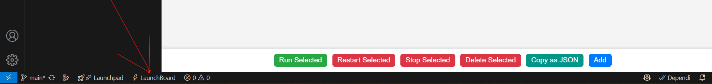
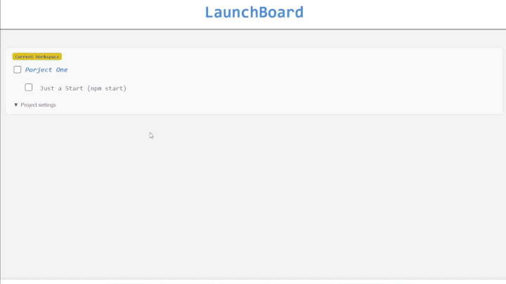

# 🚀 LaunchBoard

**LaunchBoard** is a VS Code extension that lets you run project-specific commands from a clean and simple interface – no terminal required.

## ✨ Features

- ✅ Run commands without opening a terminal  
- 🔄 Automatically launch projects when a workspace is opened  
- 📁 Manage multiple project setups  
- 📤 Export and import settings via JSON  
- ⚡ One-click start, stop, and restart  

## 📦 Installation

1. Open Visual Studio Code  
2. Go to Extensions (`Ctrl+Shift+X`)  
3. Search for "LaunchBoard" and click Install  

## 🚀 Usage

Once the **LaunchBoard** extension is installed:

- A **🚀 LaunchBoard icon** will appear in the **VS Code status bar** (bottom panel).
- Click the icon to open the LaunchBoard panel and manage your projects.

### Add Projects

- Click "Add" to register a project  
- Assign commands to be run for each project  

### Automatic Project Launch

- Enable "Automatic Project Launch" via "project setting"  to auto-run commands when the workspace opens  
- Ideal for starting dev servers, watchers, etc.

### Manage Commands

- ▶️ Run  
- 🔁 Restart  
- ⏹️ Stop  
- ❌ Delete  

### Export/Import

- 📤 Copy as JSON to export  
- 📥 Paste JSON to import settings  

## 🖼️ Quick Preview

## 🪪 License

All Rights Reserved.  
You may view the source code of this project, but you may not reproduce, distribute, modify, or use any part of it without explicit permission from the author.

© 2025 dev.akash
